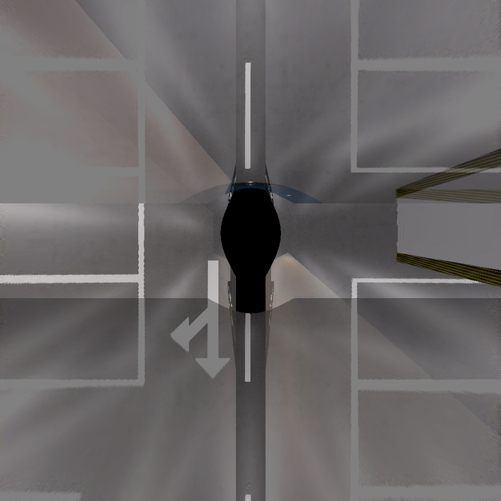

# Assignment III: IPM Image Stitching

The IPM (Inverse Perspective Mapping) projection of the panoramic camera is a crucial component in automated parking systems and can be considered foundational to such systems. For this assignment, you are required to complete the projection algorithm for the panoramic camera in the IPM image. The assignment provides four images from simulated fisheye cameras along with the intrinsic parameters of the cameras and the extrinsic parameters of the cameras relative to the vehicle's coordinate system. You need to complete the process of the projection algorithm and display the final result of the IPM projection.

The procedure to execute the steps is: you need to find the sections in the code marked with TODO, complete the implementation of these TODO parts, then compile and run the code. The final outcome should match the effect illustrated in the provided image.

## Example

## Compile and run 
Open a Terminal in your project directory:

Compile the Code:  

    mkdir build && cd build  
    cmake ..  && make  

Run the Code:

    ./ipm_generation

## Submission 
- You need to submit the completed code file.
- You need to submit a pdf file that includes the explanation of the code and the result IPM image.
